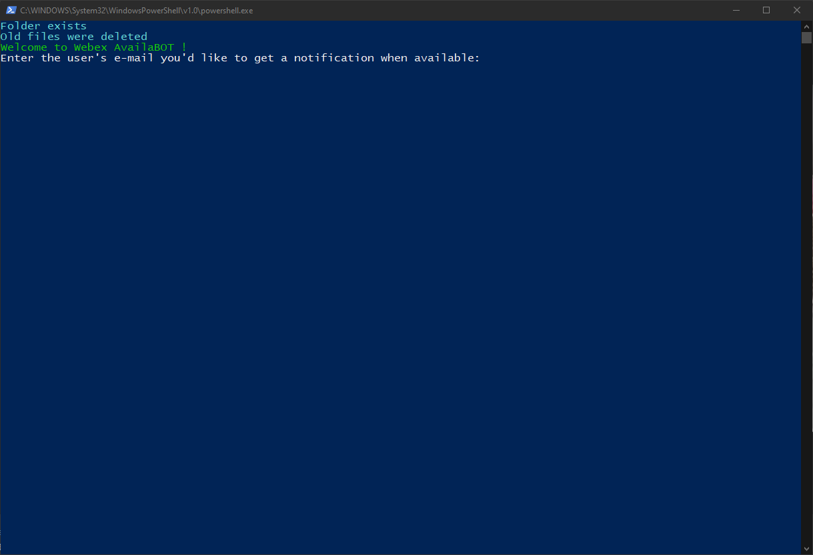

# AvailaBOT - Get notified when a contact is available in Webex Teams

- [AvailaBOT - Get notified when a contact is available in Webex Teams](#availabot---get-notified-when-a-contact-is-available-in-webex-teams)
  - [Inspiration and credits](#inspiration-and-credits)
  - [New functionalities](#new-functionalities)
    - [Recently added](#recently-added)
    - [Previously added](#previously-added)
  - [How to set it up](#how-to-set-it-up)
  - [How to use it](#how-to-use-it)
  - [Launching the script](#launching-the-script)
  - [Features to implement](#features-to-implement)

---

## Inspiration and credits

This PowerShell script will notify you when a contact is available in Webex Teams, for a chat or call.
This script was made, because Cisco, for some reason, doesn't want to include this awesome function, even if it's present in Cisco Jabber.
This project was inspired by [this AppleScript](https://github.com/CiscoDevNet/webexTeams-ContactAlertWhenAvailable) by [Yossi Meloch](https://github.com/ymeloch).

---

## New functionalities

### Recently added

- Improved notification layout, with Webex logo and user avatar (if the user has set one)

- Storing the user's avatar with a local temp file
- Deleting the local avatar after the script ends

### Previously added

- Better toast notification look
- When clicked, the notification will open Webex's chat with your selected contact
- To improve character encoding issues, the API calls are saved in a temp file and deleted once the contact is available
- Older undeleted temp files (like if you stop the script before the contact is available) are automatically deleted when you start the script again
- Support for non-existing e-mail adresses: the script will check if the user exists. If not, you'll be prompted to re-enter the e-mail
- Support for API calls errors

---

## How to set it up

In order to get the script to work, you'll need to create a token to call Cisco's API. For that, simply go to [this page](https://developer.webex.com/docs/bots) and click `Create a Bot`.
After filling some details, you'll get a Bearer token.

Simply paste this token on line 2 in `WebexAvailability.ps1`:

```powershell
<# Your personnal token from https://developer.webex.com/docs/bots #>
$token = "REPLACE_WITH_YOUR_PERSONNAL_TOKEN"
```

and you're good to go !

---

## How to use it

Simply double click on  `Run availaBOT.bat` and follow the instructions:



Simply enter the e-mail adress of the colleague or user you want to be notified and press enter. The script will check the user's status every ten second.
When the user is available, you'll get a Windows notification.

---

## Launching the script

You can start the script by either:

- Right-clicking on `WebexAvailability.ps1` and selecting `Execute with PowerShell`
- Double clicking on `Run availaBOT.bat` (preferred)

For the second option, you can even create a shortcut to this file and place it anywhere you want. A shortcut with Webex logo is already made in the repo, see the `Run availaBOT.lnk` file.
For example, I placed mine in the Start Menu, that way, I can quickly start the script anywhere:


---

## Features to implement

- [X] Integrate the URI `webexteams://im?email=firstname.lastname@example.com` to open Webex
- [ ] Add notification with windows's popup boxes
